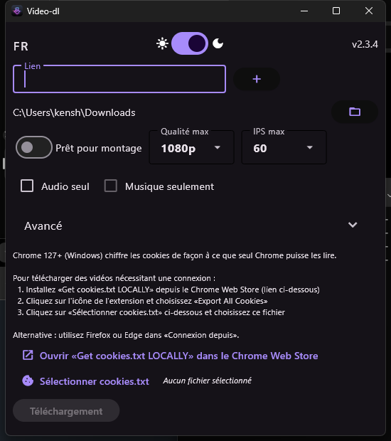

# video-dl

[English](README.md) · **Français**

Une application de bureau et Android qui pose une fenêtre devant [yt-dlp](https://github.com/yt-dlp/yt-dlp) : vous collez un lien, vous choisissez ce que vous voulez, ça télécharge. Depuis tous les sites que yt-dlp gère, et le fichier qui en sort s'ouvre vraiment dans votre logiciel de montage.

[](https://github.com/Kenshin9977/video-dl/actions/workflows/ci.yml)
[](https://github.com/Kenshin9977/video-dl/releases/latest)

<p align="center">

</p>

## Télécharger

| Windows | macOS | Linux | Android |
|:-------:|:-----:|:-----:|:-------:|
| [video-dl-windows.exe](https://github.com/Kenshin9977/video-dl/releases/latest/download/video-dl-windows.exe) | [video-dl-macos.dmg](https://github.com/Kenshin9977/video-dl/releases/latest/download/video-dl-macos.dmg) | [video-dl-linux](https://github.com/Kenshin9977/video-dl/releases/latest/download/video-dl-linux) | [video-dl-arm64-v8a.apk](https://github.com/Kenshin9977/video-dl/releases/latest/download/video-dl-arm64-v8a.apk) |

Toutes les [versions](https://github.com/Kenshin9977/video-dl/releases) sont ici. L'application se met à jour toute seule : les nouvelles versions sont téléchargées puis vérifiées sur un canal de mise à jour signé.

## Ce qu'il lui faut

**Windows** et **Android** : rien. FFmpeg, aria2c et QuickJS sont récupérés au premier lancement (Windows) ou embarqués dans l'APK.

**Linux** : installez `ffmpeg` (qui apporte `ffprobe`) depuis votre gestionnaire de paquets. Pour Intel QuickSync, ajoutez `intel-mediasdk` (apt) ou `intel-media-sdk` (pacman).

**macOS** : `brew install ffmpeg`.

## Ce qu'il fait

- **Télécharge depuis tout ce que yt-dlp gère.** [La liste](https://github.com/yt-dlp/yt-dlp/blob/master/supportedsites.md) est longue.
- **Vous rend un fichier montable.** *Prêt pour montage* remuxe la vidéo quand le codec plaît déjà à votre logiciel de montage, ce qui est instantané et sans perte, et ne réencode que lorsqu'il le faut. Les encodeurs matériels (NVENC, QuickSync, AMF, VideoToolbox) sont détectés et utilisés à la place du processeur.
- **Prend la qualité demandée**, et la plus proche en dessous quand elle n'existe pas.
- **Audio seul**, dans le codec de votre choix. *Musique seulement* va plus loin et retire les passages qui ne sont pas de la musique, via SponsorBlock.
- **Découpe un extrait**, avec un timecode de début et de fin.
- **Des playlists entières**, ou exactement les éléments que vous désignez.
- **Les vidéos qui demandent une connexion**, avec les cookies de votre navigateur. Sous Windows, Chrome 127+ chiffre ses cookies pour que lui seul puisse les lire : exportez un `cookies.txt` et donnez-le à l'application, ou utilisez Firefox ou Edge, qu'elle lit directement.
- **Les sous-titres**, et un proxy si vous en avez besoin.
- **Plusieurs liens d'affilée** : mettez-les en file avec le bouton `+`.
- Les téléchargements passent par **aria2c** sur plusieurs connexions, et les deux barres, celle du téléchargement et celle du traitement, avancent vraiment.
- Français, anglais et allemand. Clair et sombre.

## Sous le capot

Le yt-dlp officiel depuis PyPI, épinglé à une version exacte. Pas de fork.

yt-dlp ne rapporte aucune progression pendant que FFmpeg tourne ni pendant qu'aria2c télécharge. Quatre extensions de ce dépôt l'ajoutent (`core/ytdlp_patch.py`, `core/ffmpegfd_progress.py`, `core/aria2c_progress.py`, `core/vk_extractor.py`), sur les points d'extension de yt-dlp lui-même. Une accroche qui cesse de s'appliquer coûte une barre de progression, jamais un téléchargement. La CI vérifie chaque accroche contre le yt-dlp installé, et le binaire packagé refuse de se construire si l'une d'elles ne s'applique plus.

Les mises à jour de yt-dlp sont ouvertes, testées et publiées automatiquement.

## Compiler depuis les sources

Il faut Python >= 3.12, [uv](https://docs.astral.sh/uv/), et ffmpeg dans le PATH.

```bash
git clone https://github.com/Kenshin9977/video-dl.git
cd video-dl
uv sync --extra dev

uv run python main.py            # lancer
uv run python main.py --debug    # avec les logs
uv run pytest                    # les tests
```

Packager :

```bash
uv run pyinstaller specs/Windows-video-dl.spec   # ou macOS-, ou Linux-
```

## Signature du code

Le binaire Windows est signé en Authenticode et horodaté avec un certificat Certum Open Source Code Signing. Le certificat ne passe jamais par la CI : le build envoie le binaire à un hôte de signature via SSH, et la publication est refusée si Windows ne déclare pas la signature valide.

L'APK est signé avec une clé de release, et le build relit la signature dans l'APK terminé : la publication est refusée si l'empreinte n'est pas celle attendue. Android n'a pas d'autorité de certification — tous les APK sont auto-signés — donc il n'y a rien à acheter chez Certum ici, et la réputation s'attache à la clé de signature elle-même. D'où l'accueil de Play Protect à la première installation, *Play Protect n'a jamais vu d'appli de ce développeur avant* : c'est une remarque sur l'âge de la clé, pas sur l'application. Faites *Plus de détails → Installer quand même*. Le message ne disparaît que pour les applications du Play Store, et le Play Store n'accepte pas les applications qui téléchargent des vidéos depuis YouTube.

- Commits, relecture et approbation : [Kenshin9977](https://github.com/Kenshin9977)

## Vie privée

Ce programme n'envoie rien nulle part, sauf ce que vous lui demandez : récupérer la vidéo à l'URL que vous lui donnez, et vérifier ses propres mises à jour.

## Construit avec

- [yt-dlp](https://github.com/yt-dlp/yt-dlp)
- [FFmpeg](https://github.com/yt-dlp/FFmpeg-Builds)
- [aria2](https://aria2.github.io/)
- [Flet](https://flet.dev/)
- [tufup](https://github.com/dennisvang/tufup), pour les mises à jour signées
