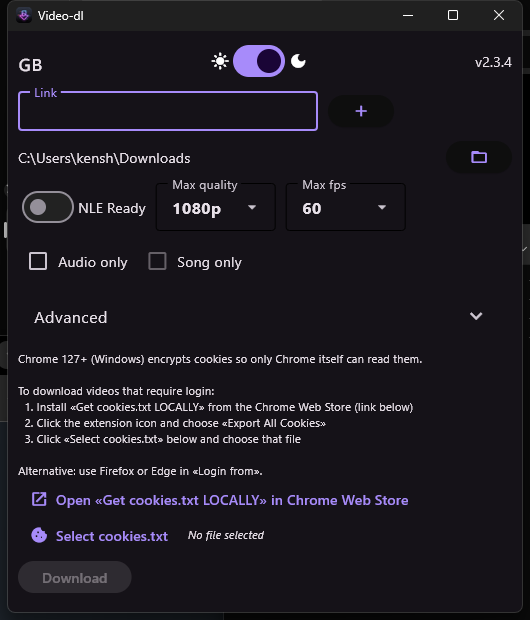

# video-dl

**English** · [Français](README.fr.md)

A desktop and Android app that puts a window in front of [yt-dlp](https://github.com/yt-dlp/yt-dlp): paste a link, pick what you want, download. It downloads from every site yt-dlp supports, and it hands you a file your video editor will actually open.

[](https://github.com/Kenshin9977/video-dl/actions/workflows/ci.yml)
[](https://github.com/Kenshin9977/video-dl/releases/latest)

<p align="center">

</p>

## Download

| Windows | macOS | Linux | Android |
|:-------:|:-----:|:-----:|:-------:|
| [Installer](https://github.com/Kenshin9977/video-dl/releases/latest/download/video-dl-windows-setup.exe) | [video-dl-macos.dmg](https://github.com/Kenshin9977/video-dl/releases/latest/download/video-dl-macos.dmg) | [video-dl-linux](https://github.com/Kenshin9977/video-dl/releases/latest/download/video-dl-linux) | [video-dl-arm64-v8a.apk](https://github.com/Kenshin9977/video-dl/releases/latest/download/video-dl-arm64-v8a.apk) |

On Windows the installer adds Start Menu and desktop shortcuts. If you would rather not install, the [portable exe](https://github.com/Kenshin9977/video-dl/releases/latest/download/video-dl-windows.exe) runs on its own.

Every [release](https://github.com/Kenshin9977/video-dl/releases) is here. The app updates itself: new versions are downloaded and verified against a signed update channel.

## What it needs

**Windows** and **Android**: nothing. FFmpeg, aria2c and QuickJS are fetched on first launch (Windows) or shipped inside the APK.

**Linux**: install `ffmpeg` (which brings `ffprobe`) from your package manager. For Intel QuickSync, add `intel-mediasdk` (apt) or `intel-media-sdk` (pacman).

**macOS**: `brew install ffmpeg`.

## What it does

- **Downloads from anything yt-dlp supports.** [The list](https://github.com/yt-dlp/yt-dlp/blob/master/supportedsites.md) is long.
- **Hands you an editable file.** *NLE Ready* remuxes the video when the codec is already one your editor likes, which is instant and lossless, and re-encodes only when it has to. Hardware encoders (NVENC, QuickSync, AMF, VideoToolbox) are detected and used instead of your CPU.
- **Picks the quality you asked for**, and the closest one below when it does not exist.
- **Audio only**, in the codec of your choice. *Song only* goes further and cuts the non-music parts out, using SponsorBlock.
- **Cuts a range**, with a start and an end timecode.
- **Whole playlists**, or the exact items you name.
- **Videos that need a login**, using the cookies from your browser. On Windows, Chrome 127+ encrypts its cookie store so that only Chrome can read it: export a `cookies.txt` and hand it to the app, or use Firefox or Edge, which it can read directly.
- **Subtitles**, and a proxy if you need one.
- **Several links at a time**: queue them up with the `+` button.
- Downloads run through **aria2c** over several connections, and both bars, the download and the processing one, actually move.
- English, French and German. Light and dark.

## Under the hood

Upstream yt-dlp from PyPI, pinned to an exact version. No fork.

yt-dlp reports no progress while FFmpeg runs or while aria2c downloads. Four extensions in this repository add it (`core/ytdlp_patch.py`, `core/ffmpegfd_progress.py`, `core/aria2c_progress.py`, `core/vk_extractor.py`), on yt-dlp's own extension points. A hook that stops applying costs a progress bar, never a download. CI checks each hook against the installed yt-dlp, and the packaged binary refuses to build if one no longer applies.

yt-dlp bumps are opened, tested and released automatically.

## Build from source

Needs Python >= 3.12, [uv](https://docs.astral.sh/uv/), and ffmpeg on your PATH.

```bash
git clone https://github.com/Kenshin9977/video-dl.git
cd video-dl
uv sync --extra dev

uv run python main.py            # run it
uv run python main.py --debug    # with logs
uv run pytest                    # the tests
```

Package it:

```bash
uv run pyinstaller specs/Windows-video-dl.spec   # or macOS-, or Linux-
```

## Code signing

The Windows binary is Authenticode-signed and timestamped with a Certum Open Source Code Signing certificate. The certificate never touches CI: the build streams the binary to a signing host over SSH, and the release refuses to publish if Windows does not report the signature as valid.

The APK is signed with a release key, and the build reads the signature back out of the finished APK and refuses to publish unless its fingerprint is the pinned one. Android has no certificate authority — every APK is self-signed — so there is nothing to buy from Certum here, and reputation attaches to the signing key itself. Which is why Play Protect greets a first install with *Play Protect has never seen this developer before*: it is a statement about the key's age, not about the app. Tap *More details → Install anyway*. The warning goes away only for apps on the Play Store, and the Play Store does not accept apps that download videos from YouTube.

- Committers, reviewers and approvers: [Kenshin9977](https://github.com/Kenshin9977)

## Privacy

This program sends nothing anywhere, except what you ask it to: fetching the video at the URL you gave it, and checking for its own updates.

## Built with

- [yt-dlp](https://github.com/yt-dlp/yt-dlp)
- [FFmpeg](https://github.com/yt-dlp/FFmpeg-Builds)
- [aria2](https://aria2.github.io/)
- [Flet](https://flet.dev/)
- [tufup](https://github.com/dennisvang/tufup), for signed updates
